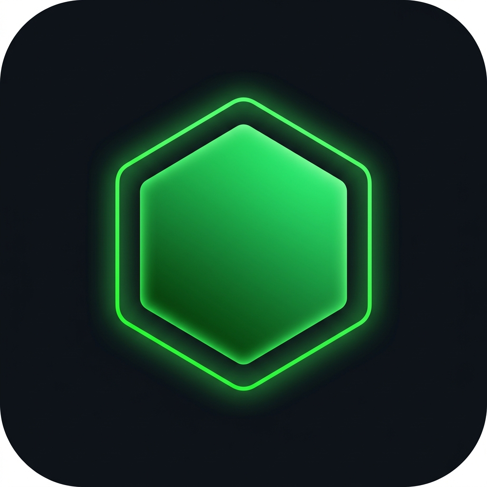

# T U R F

### Every step is a claim.

Turf is a geospatial strategy layer overlaid on the physical world. It transforms movement into digital sovereignty, allowing users to carve out territories, defend regions, and dominate their surroundings through physical presence and tactical movement.



---

## ✦ THE EXPERIENCE

Turf isn't just an app; it’s a shift in how you perceive your environment. 

*   **PULSE**: Your location is your brush. As you move, you paint your path across the global grid.
*   **CLAIM**: Closing a loop isn't just a geometry problem; it's an act of possession. Complete a circuit to claim the land within.
*   **REIGN**: Sovereignty isn't permanent. Territories decay, challengers arrive, and the map is always in flux. It demands consistency, speed, and strategy.

---

## ⚙️ HOW IT WORKS

The system operates on a precise intersection of satellite telemetry and geometric validation.

*   **High-Fidelity Tracking**: Continuous GPS polling with noise-reduction filters for precise pathing.
*   **Polygon Closure**: Ramer-Douglas-Peucker simplification manages path complexity while maintaining geometric integrity.
*   **Area Validation**: Real-time calculation of square-meterage with hard limits to ensure competitive balance.
*   **Intersection Logic**: Robust edge-detection prevents overlapping claims unless specific "Sovereign Override" conditions are met.

---

## 🏗️ SYSTEM ARCHITECTURE

A lean, high-performance stack built for low-latency geospatial interaction.

*   **Client**: Flutter (Typed, Reactive, Motion-Driven)
*   **Engine**: Custom Dart-based Geo-Compute Engine
*   **State**: Real-time stream-based synchronization
*   **Database**: Supabase + PostGIS for spatial queries and persistent world state
*   **Maps**: MapLibre GL with custom-rendered tactical tiles

---

## 🎨 DESIGN PHILOSOPHY: TACTICAL MINIMALISM

We rejected "Game UI" in favor of "Tactical System" design.

*   **High-Contrast Dark Mode**: Pure blacks and slate grays prioritize map visibility and battery longevity.
*   **Uncodixified HUD**: No floating cards or neon clutter. Information is rendered in a high-utility, structured hierarchy inspired by aeronautical displays.
*   **Intentional Spacing**: An 8pt grid system ensures precision and clarity even during high-intensity movement.

---

## 🎬 MOTION & INTERACTION

Every movement has weight.

*   **Haptic Pulse**: Micro-haptics provide confirmation as you close geometry.
*   **Counter-Tick Choreography**: XP and territory stats increment with smooth, staggered easing.
*   **The Pulse**: A subtle, rhythmic animation on the player's core represents real-time location accuracy and "active capture" status.

---

## 🛠️ TECH STACK

| Layer | Technology |
| :--- | :--- |
| **Frontend** | Flutter |
| **Mapping** | MapLibre / MapTiler |
| **Backend** | Supabase (PostgreSQL) |
| **Spatial** | PostGIS |
| **Logic** | Sovereign-State Architecture |
| **Motion** | Lottie / Custom Animation Controllers |

---

## 🚀 GETTING STARTED

### Prerequisites
*   Flutter SDK (3.10.0+)
*   MapTiler API Key
*   Supabase Environment

### Environment Setup
Create a `.env` file or use `--dart-define`:
```bash
MAP_TILER_KEY=your_key_here
SUPABASE_URL=your_url_here
SUPABASE_ANON_KEY=your_key_here
```

### Run
```bash
flutter run
```

---

## 🔮 FUTURE VISION

The horizon for Turf is expansive.

*   **Faction Alliances**: Collaborative territory control and regional dominance.
*   **Strategic Decay**: Dynamic decay rates based on regional activity density.
*   **Augmented Layer**: Real-time battle visualizers for contested borders.

---

### 
### 

---

**"The world is a grid. Start claiming your squares."**

*Designed and Engineered as a Sovereign System.*
